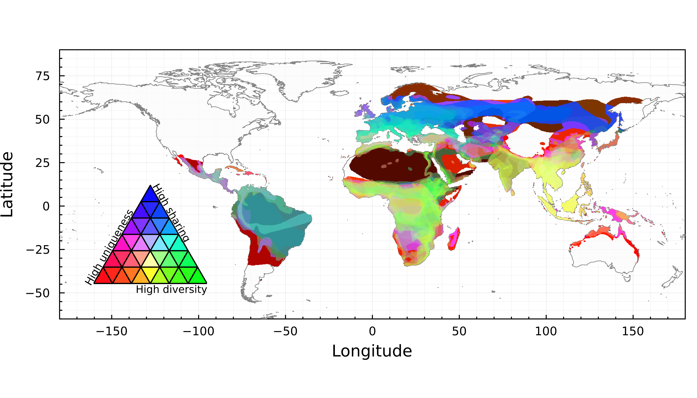
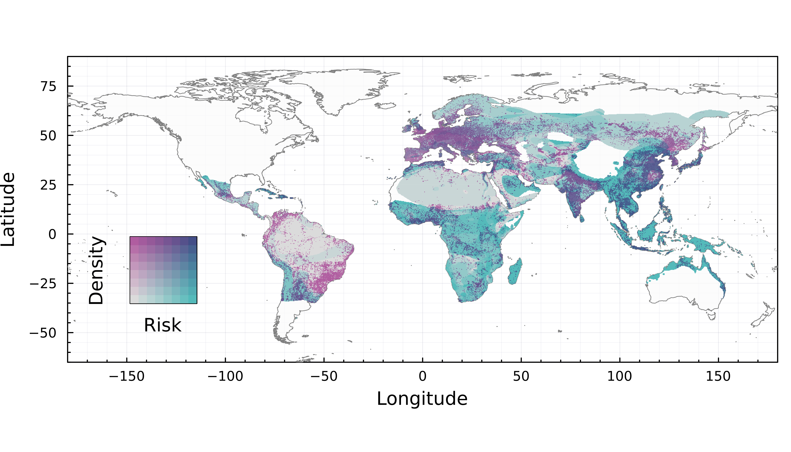

Spillover risk is not unidimensional. From the standpoint of an animal
community, *i.e.* a pool of suitable hosts, it is driven by a multiplicity of
factors [@Plowright2017PatZoo]. The global richness of hosts is one such
component commonly mentioned/analysed [see *e.g.* @Anthony2017GloPat for
coronaviruses], but there is an argument to be made that species who are not
competent (or know) hosts of a specific virus genus may not factor into this
[@Plowright2015EcoDyn], or that species who are assumed to share viruses at
different rates should be weighted accordingly [@Albery2020PreGlo]. In mammals,
key functional traits (for which phylogeny is a reasonable proxy) are
determinants of the spillover potential [@Olival2017HosVir]; these include,
notably, body mass and affinity for urban environments [@Albery2022UrbMam].
Finally, especially when the pool of potential hosts spans the entire globe,
there may be local host pools that are highly unique; not having been observed
in other locations, these can act on the overall risk either by providing novel
contact opportunities, reflecting unique host-environment combinations
[@Engering2013PatHos], or facilitating rapid evolutionary changes in specialism
of their pathogens [@Agosta2010HowSpe]. In the specific case of generalist
pathogens, there is conceptual and empirical support to the idea that these
community- level mechanisms are even more important in driving the overall risk
[@Power2004PatSpi].

Bats are important reservoir hosts for different classes of microorganisms  (Chu
2008, Donaldson 2010, Li 2010), some of which can threaten human health.
Chiropterans emerged around 64 million years ago and are one of the most diverse
mammalian orders, with an estimated richness of more than 14000 species
[@Peixoto2018SynEco; @Simmons2020BatSpe]. They exhibit a broad variety of
habitat use, behaviour, and feeding strategies, resulting in their playing an
essential role in the delivery of several ecosystem services tied to important
ecosystem-derived benefits [@Kasso2013EcoEco]. For example, over two-thirds of
bats are know to be either obligate or facultative insectivorous mammals,
therefore playing an important role in the regulation of insect pests that can
affect crops [@Voigt2016BatAnt; @Williams-Guillen2008BatLim], and vectors of
diseases that put a risk on human health [@Gonsalves2013MosCon;
@Gonsalves2013MosInf]. Because bats are globally distributed and have a long
evolutionary history, phylogeographic and biogeographic approaches are required
to shed light on the extant distribution of coevolutionary processes between
bats and the pathogens they carry. Not all areas in which bats, viruses, and
human are co-occuring are facing a risk of spillover towards human populations,
and the areas in which this risk exist may not be facing risks of the same
nature and magnitude.

In this paper, we examine the biogeographic structure of bats-betacoronaviruses
associations, based on a curated dataset of known and recently discovered hosts.
This work is important both as a description of the bats-betacoronavirus
complex, but aslo because more broadly, bats are known reservoirs for a variety
of emerging viruses and pathogens [@Calisher2006BatImp;@Melaun2014BatPot],
making balancing the needs for bat conservation and disease prevention a
potentially difficult act and a source of human-wildlife conflicts, especially
in more densely populated areas [@Rego2015AssHum; @Stone2015ManCon]. By drawing
on concepts from the Geographic Mosaic Theory of Coevolution
[@Thompson2005GeoMos], we turn these associations into a spatially explicit
additive mapping of zoonotic risk components, which reveals extreme
heterogeneity of risk at the global scale; furthermore, we identify the Amazon
and South-Eastern Asia as hotspots of phylogenetic distinctiveness of
betacoronaviruses [@Anthony2017GloPat]; surprisingly, current data suggest that
viral sharing between hosts in high in the Amazon and low in South-Eastern Asia,
which has the potential to result in different evolutionary dynamics between
these two regions.

# Methods

## Known betacoronavirus hosts

We downloaded the data on bats hosts of betacoronaviruses assembled by
@Becker2022OptPre from `https://www.viralemergence.org/betacov` on Apr. 2022,
and filtered it to "known" hosts (established before the emergence of
SARS-CoV-2) and "novel" hosts (confirmed through sampling since the emergence of
SARS-CoV-2). The original database was assembled by a combination of data mining
and literature surveys, including automated alerts on the "bats" and
"coronavirus" keywords to identify novel empirical evidence of
bats-betacoronaviruses associations.

## Bats occurrences

We downloaded the rangemap of every extant bat species that was either
classified as an empirically documented host of beta-coronaviruses from the
previous step, according to recent IUCN data [@IUCN2021IucRed]. The range maps
were subsequently rasterized using the `rasterize` function from `GDAL`
[@RouaultEven2022GdaOgr] at a resolution of approximately **TK TP**. For every
pixel in the resulting raster where at least one bat host of betacoronavirus was
present, we extract the species pool (list of all bat species), which was used
to calculate the following risk assessment components: phylogenetic diversity,
bat compositional uniqueness, and predicted viral sharing risk.

## Bats phylogeography

For every pixel, we measured Faith’s Phylogenetic Diversity [@Faith1992ConEva]
based on a recent synthetic tree with robust time calibration, covering about
6000 mammalian species [@Upham2019InfMam]. Faith’s PD measures the sum of unique
branches from an arbitrary root to a set of tips, and comparatively larger
values indicate a more phylogenetic diverse species pool. We measured
phylogenetic diversity starting from the root of the entire tree (and not from
Chiroptera); this bears no consequences on the resulting values, since all
branches leading up to Chiroptera are only counted one per species pool, and (as
we explain when describing the assembly of the composite risk map), all
individual risk components are ranged in [0,1]. This measure incorporates a
richness component, which we chose not to correct for; the interpretation of the
phylogenetic diversity is therefore a weighted species richness, that accounts
for phylogenetic over/under-dispersal in some places.

## Bats compositional uniqueness

For every species pool, we measured its Local Contribution to Beta-Diversity
[@Legendre2013BetDiv]; LCBD works from a species-data matrix (traditionally
noted as $\mathbf{Y}$), where species are rows and sites are columns, and a
value of 1 indicates occurrence. We extracted the Y matrix assuming that every
pixel represents a unique location, and following best practices
[@Legendre2019SpaTem] transformed it using Hellinger’s distance to account for
unequal bat richness at different pixels. The correction of raw community data
is particularly important for two reasons: first, it prevents the artifact of
richer sites having higher importance; second, it removes the effect of overall
species richness, which is already incorporated in the phylogenetic diversity
component. High values of LCBD indicate that the pixel has a community that is
on average more dissimilar in species composition than what is expected knowing
the entire matrix, i.e. a more unique community. Recent results by
@Dansereau2022EvaEco shows that LCBD measures are robust with regards to spatial
scale, and are therefore applicable at the global scale.

## Viral sharing between hosts

For all bat hosts of betacoronaviruses, we extracted their predicted viral
sharing network [@Albery2020PreGlo]. This network stores pairwise values of
viral community similarity. To project viral sharing values into a single value
for every pixel, we averaged the pairwise scores. High values of the average
sharing propensity means that this specific extant bat assemblage is likely to
be proficient at exchanging viruses.

## Composite risk map

To visualize the aggregated risk at the global scale, we combine the three
individual risk components (phylogenetic diversity, compositional uniqueness,
and viral sharing) using an additive color model [@Seekell2018GeoLak]. In this
approach, every risk component gets assigned a component in the RGB color model
(phylogenetic diversity is green, compositional uniqueness is red, and viral
sharing is blue). In order to achieve a valid RGB measure, all components are
re-scaled to the [0,1] interval, so that a pixel with no sharing, no
phylogenetic diversity, and no compositional uniqueness is black, and a pixel
with maximal values for each is white. This additive model conveys both the
intensity of the overall risk, but also the nature of the risk as colors diverge
towards combinations of values for three risk components. Out of the possible
combinations, the most risky in terms or rapid diversification and spillover
potential is high phylogenetic diversity and low viral sharing
[@Cavender-Bares2009MerCom; @Gomulkiewicz2000HotSpo], in that this allows
multiple independent host-virus coevolutionary dynamics to take place in the
same location. In the colorimetric space, this correspond to yellow -- because
the HSV space is more amenable to calculations for feature extraction [see
*e.g.* @Keke2010StuSki], we measured the risk level by calculating the angular
distance of the hue of each pixel to a reference value of 60, and weighted this
risk level by the value component. Specifically, given a pixel with colorimetric
coordinates $(h,s,v)$, its ranged weighted risk value is

$$
v\times\left[1-\frac{\left|\text{atan}\left(\text{cos}(\text{rad}(h)), \text{sin}(\text{rad}(h))\right) - X\right|}{2\pi}\right]\,,
$$

where X is $\text{atan}\left(\text{cos}(\text{rad}(60)),
\text{sin}(\text{rad}(60))\right)$, a constant approximately equal to $0.5235$.

## Viral phylogeography and evolutionary diversification

We used the following query to pull all betacoronavirus sequence data from the
GenBank Nucleotide database except SARS-CoV-2; ("Betacoronavirus"[Organism] OR
betacoronavirus[All Fields]) NOT ("Severe acute respiratory syndrome coronavirus
2"[Organism] OR sars-cov-2[All Fields]). We added a single representative
sequence for SARS-CoV-2 and manually curated to remove sequences without the
RNA-dependent RNA polymerase (RdRp) sequence or that contained words indicating
recombinant or laboratory strains including “patent”, “mutant”, “GFP”, and
“recombinant”. We filtered over-represented taxa including betacoronavirus 1,
hCoV-OC43, Middle East respiratory syndrome coronavirus, Murine hepatitis virus,
and hCoV-HKU1. Curated betacoronavirus RdRp sequences were then aligned using
MAFFT v 1.4.0 (**Katoh and Standley 2013**, parameters in text?) and a maximum likelihood
tree reconstructed in IQ-TREE v 1.6.12 (Nguyen et al. 2015) with ModelFinder
(Kalyaanamoorthy et al. 2017) ultrafast bootstrap approximation (Hoang et al.
2018) and the following parameters (**STEPH WILL ADD**, parameters in text?).

We first tested the hypothesis that hotspots of viral diversification would
track hotspots of bat diversification. To do so, we plotted the number of known
bat hosts (specifically only those included in the phylogeny, so there was a 1:1
correspondence between data sources) against the “mean evolutionary
distinctiveness” of the associated viruses. To calculate this, we derived the
fair proportions evolutionary distinctiveness [@Isaac2007MamEdg] for each of the
viruses in the tree, then averaged these at the bat species level, projected
these values onto their geographic distributions, and averaged across every bat
found in a given pixel. As such, this can be thought of as a map of the mean
evolutionary distinctiveness of the known viral community believed to be
associated with a particular subset of bats present.

## Co-distribution of hosts and viral hotspots

Subsequently, we tested the hypothesis that the biogeography of bat
betacoronaviruses should track the biogeography of their hosts. To test this
idea, we loosely adapted a method from [@Kreft2007GloPat; @Kreft2010FraDel], who
proposed a phylogenetic method for the delineation of animal biogeographic
regions. In their original method, a distance matrix - where each row or column
represents a geographic raster’s grid cell, and the dissimilarity values are the
“beta diversity similarity” of their community assemble - undergoes non-metric
multidimensional scaling (NMDS); the first two axes of the NMDS are projected
geographically using a four-color bivariate map. Here, we build on this idea
with an entirely novel methodology. First, we measure the phylogenetic distance
between the different viruses in the betacoronavirus tree by using the
cophenetic function in `ape` [@Paradis2019ApeEnv]; subsequently, we take a
principal components analysis of that distance matrix (readily interchangeable
for NMDS in this case) to project the viral tree into an n-dimensional space. We
then take the first two principal components and, as with the evolutionary
distinctiveness analysis, aggregated these to a mean host value and projected
them using a four-color bivariate map.

# Results and discussion

## Host distribution

Bats are found worldwide and are one of the most diverse groups among mammals
(Moratelli & Calisher, 2015), and one of the main animal reservoir for different
strains of betacoronaviruses [@Drexler2014EcoEvo]. This has attracted attention
to areas where high diversity of bats, and therefore presumably high diversity
of betacoronaviruses, can be an important issue for human health
[@Calisher2006BatImp; @Moratelli2015BatZoo]. Accordingly, we collected the IUCN
rangemaps for known hosts of betacoronaviruses, to illustrate where hotspots of
host diversity are. These results are presented in Fig xx.a. As per our current
knowledge of which bats are hosts of betacoronaviruses, these hotspots are
primarily South-East Asia, parts of Europe, and to a lesser extent sub-saharan
Africa. Even the subset of chiroptera that are hosts of betacoronaviruses fits
the evolutionary timeline of the group. Chiropterans can be classified as
Microchiroptera and macrochiroptera, where macrochiroptera have an older history
from an evolutionary perspective compared to macrochiroptera
[@Springer2013PhyBat; @Teeling2005MolPhy].

South-East Asia has a high diversity of bats (**Kingston, 2010**), and our
results show that part of that diversity includes betacoronavirus hosts. High
density of hosts sharing the same virus (albeit possibly different strains)
calls into question the evolution of the bat antiviral immune system and its
co-evolution with viruses, which may result in distinct immunological responses
in different areas, as evidenced in other bat species [@Banerjee2020NovIns].
Immune characteristics that allow bats to be better adapted to infection by
emerging viruses (Gorbunova et al., 2020; Irving et al., 2021) may be related to
a wide variety of diets (Jones et al., 2022; Moreno Santillán et al., 2021;
Banerjee et al., 2020; Schneeberger et al., 2013). Considering whether viruses
easily adapted to multiple hosts have lower virulence on these hosts, or lower
ability to jump to hosts with different immune characteristics, should yield
valuable additional predictors for the total risk of spillover. Previous
research (**Anthony et al., 2017; Mollentze & Streicker, 2020**) states that
locally diverse bat communities could maintain more viruses and hence, a higher
probability of having a pathogen that could represent a risk for human health;
locally diverse, virus-rich bats communities could represent an increased risk
of spillover under climate change (**Ice ice berg berg**). This probability
involves multiple factors, among which the relatedness of hosts (which can make
the jumps easier (**Longdon et al., 2011; Mollentze et al., 2020; Wolfe et al.,
2007**), and the overall tendency of hosts within a locality to share viruses,
which may limit viral diversity because of within-host competition (Leeks et
al., 2018; Sallinen et al., 2020). All things considered, the richness of known
betacoronaviruses hosts is not a sufficient predictor of spillover risk.

## Viral evolutionary distinctiveness

Higher host diversity may not result in a higher viral diversity, for example if
all hosts share the same viruses, or share closely evolutionarily related
strains. For this reason, we quantified and mapped the evolutionary
distinctiveness of betacoronaviruses, based on their position in a molecular
phylogeny. Viral evolutionary distinctiveness largely tracks host diversity,
particularly in southern China but, oddly, not throughout the rest of southeast
Asia. This indicates, perhaps, that many distinctive viruses remain to be discovered
in this region (an idea that is unsurprising given the growing realization,
around the emergence of SARS-CoV-2, that a unique lineage of similar viruses are
widespread in bats but still mostly undescribed). The most distinct
betacoronaviruses are found in South America, a region with a comparatively
lower number of hosts; this suggests that the South American bat-betacoronvirus
complex has been more isolated, and is probably undergoing a different
co-evolutionary dynamic. Alternatively, this distinctiveness hostpot may be a
product of under-sampling: South-America is one of the places where the fewest
betacoronaviruses have been discovered [@Anthony2017GloPat], and adding more
viruses would bring the distinctiveness of known sequences down. Previous work
has suggested the Americas may be a hotspot of both undiscovered bat viruses in
general [@Allen2017GloHot; @Olival2017HosVir] and coronavirus specifically
[@Anthony2017GloPat], though not necessarily betacoronaviruses, and particularly
not those in clades with notable zoonotic potential.

## Geographic Mosaic of bat-betacoronavirus risk

In order to turn the hypotheses based on the Geographic Mosaic Theory of
Coevolution into a measure of risk, we overlapped three components of spillover
risk: viral sharing, *i.e.* the chance that two bats will share viruses overall;
Local Contribution to Beta Diversity, *i.e.* the fact that a bat community is
compositionally unique compared to the average compositional similarity across
the entire system; finally, the phylogenetic diversity, *i.e.* how dispersed the
bats in a location are within the tree of life. These results are presented
using an additive color mapping in Figure xx, and lead to the definition of
broad biogeographic regions of risk, where the same color represents the same
type of risk. Pairwise maps of the three components are present in supplementary
materials.

{#fig:trivariate}

From the perspective of spillover risk, the most important combination of
factors is a high phylogenetic diversity of hosts with low viral sharing; this,
essentially, means that very different betacoronavirus could co-exist within the
same place. This is particularly the case given that betacoronaviruses often
evolve and even achieve host shifts through recombination, which requires the
co-occurrence of sufficiently distinct viruses to be a major driver of
emergence. In Fig. xx, this corresponds to yellow to pale green areas, which are
essentially limited to South-Eastern Asia, and to some part of Sub-Saharan
Africa. Adopting a geographic mosaic theory perspective on risk, other regions
of the world are of lesser concern.

{#fig:risk}

Available data on bat betacoronavirus spillover into humans (TP overlay on the
figure) is limited and circumstantial at best for these purposes, but our risk
maps suggest that the areas predicted by prior expectations about host
biogeography correspond loosely to those where previous emergence events have
been recorded. Areas with high bat diversity and high turnover may facilitate
the evolutionary radiation of viruses, matching previous findings that the
diversification of bat coronaviruses is driven largely by host shifts
(inter-genus or higher levels of cross-species transmission) and, to a lesser
degree, cospeciation and sharing (intra-genus cross-species transmission;
Anthony et al. 2017). This diversification - while not an actual risk factor for
spillover itself - likely increases the random chance of a virus with the raw
genomic components required for the potential to infect humans.

## Global distribution of spillover risk

Based on the previous result, we extracted the yellow component of the risk map
(TP add methods), to provide a single measure of risk varying between 0 and 1.
This measure is presented in Fig. xxA. However, this maps the potential risk,
which must be weighed by the potential for contacts with humans. As a proxy for
this measure, we used the proportion of build/urban land from the EarthEnv
dataset: this is a reasonable proxy for the density of humans per unit area,
which increases the probability of pathogen spread more widely (Hazarie et al.,
2021). Since human activity is required to amplify the frequency of virus
encounters and thus create areas of viral amplification, mapping the potential
risk against measures of land use is required to generate a more actionable
assessment of risk. This map is presented in Fig. xxB. Most of South America and
Europe are at low risk, as although densely populated, settlements tend to be in
areas with lower potential risk. However, this mapping reveals that South-East
Asia, the Indian subcontinent, and parts of sub-Saharan Africa, are at high risk
due to the overlap between built areas and bat communities representing more
opportunities for cross-species transmission of betacoronaviruses.

{#fig:compound}

Finally, we provide a summary visualization of what available information
describes the spillover of zoonotic betacoronaviruses of bat origin where data
was available before and up through the COVID-19 pandemic. The SARS-CoV-2
outbreak was georeferenced to the initial case cluster in Wuhan, China; SARS-CoV
was georeferenced based on the cave with the closest known viruses circulating
in nature (Hu et al. 2017 PLoS Pathogens), and a nearby location where
serological (antibody) evidence has indicated human exposure to SARS-like
viruses (Wang et al. 2018 Virologica Sinica). For MERS-CoV, we presented the
index cases available from a recently-published compendium of MERS-CoV cases
(Ramshaw et al. 2019); these are largely if not all presumed to be
camel-to-human transmission, and the precise origin point of MERS-CoV in bats is
uncertain. Not shown is a recent case of a recombinant canine coronavirus that
showed the ability to infect humans, both because this study was published after
the beginning of the COVID-19 pandemic and because bats’ involvement in this
cycle of transmission has been marginal to non-existent.

Our study focuses largely on the biogeography of hosts. Yet, we know that
viruses with high host plasticity, that is, the ability of a given virus to
adapt to various taxonomic orders and ecological groups (Kreuder Johnson et al.,
2015); are more likely to amplify viral spillover, followed by secondary
human-to-human transmission, and geographical spread (Hazarie et al., 2021).
High viral host plasticity is an especially important trait for RNA viruses such
as betacov (Kreuder Johnson et al., 2015; Haddad et al., 2021). Indeed, our
analysis of viral sequences reveals that Latin America is a hotspot of viral
distinctiveness, suggesting that this part of the bats-betacov system may be
undergoing independent evolutionary dynamics (related species sharing viruses
that are different from the rest of the global pool). The other hotspot of viral
distinctiveness is S.E. Asia, in which richness is high but sharing is low; this
suggests a different type of evolutionary dynamics (unrelated viruses coevolving
with evolutionarily distinct hosts, generating high diversity locally).

# Conclusion

Driven by the need to understand the ecological factors involved in the
emergence of viral pathogens, we spatially mapped bat-betacoronavirus
interactions worldwide, using (i) a database of known betacov hosts(Becker et
al., 2020), and (ii) range maps for the hosts according to IUCN (IUCN 2021). To
reflect the fact that the risk posed by viruses has many ecological origins, we
quantified the phylogenetic diversity of hosts, their compositional uniqueness,
and the expected viral sharing. Because these components of risk matter when
contrasted to human density, we compared them to a proxy, namely the proportion
of each pixel that is covered by urban or built land. This provides a synthetic
risk map, allowing to identifying of hotspots where the bat-betacoronavirus
system may originate viruses in humans. SE Asia is one of the regions with the
highest risk since, according to our results, several of its conditions could
increase the risk of transmission of the virus.

Species richness, therefore, is not a sufficient measure of viral risk. This is
exemplified in our results, where both South America and South-Eastern Asia have
a high species richness of betacov hosts, but only the latter region has a high
risk. Specifically, because previous studies propose that Asia is important when
it comes to understanding the evolutionary origin of various mammalian taxa
(Beard C K, 1988).

There are several factors that drive changes in the diversity of bats (Alves et
al., 2018), but human activities' effects on the ecosystem (like modifications
of land use) could significantly decrease it. Therefore, it can be suggested
that changes in the diversity of betacovs in bats are linked to their
biogeographic variation, and human population density and other anthropogenic
factors are decisive moderators for its implications in public health. With the
increase of contact between humans and potential hosts, we also increase the
risk of emergence of novel diseases (Johnson et al., 2020), as previous studies
on RNA viruses suggest the importance of host phylogeography at the time of
virus dispersal (Gryseels et al., 2017).

This diversity of hosts and how the exchange of viruses occurs between species,
is largely affected by the different environmental changes, as the case of
sarbecovirus bats reservoirs (Muylaert et al., 2021) where they are affected by
the area of the cave or the alteration of the forest, which could result in
modifications of host distribution. Additionally, our results highlight the
importance of Asia as a betacov hotspot, which is consistent with recent studies
(Muylaert et al., 2021), where projections on this area suggest that new future
events of sarbecovirus viral exchange might be easily spread among species or
humans.

One of these scenarios where interaction between bats and humans can occur can
be seed dispersal in tropical agroecosystems. It opens the discussion of whether
the fruits thrown by bats not only disperse seeds but could also be a source of
indirect interaction between viruses of bat origin and humans (Deshpande et al.,
2022) . This represents a challenge for conservation strategies and disease
ecology since we have areas with potential zoonotic viruses and bat-human
interaction. However, it must still be taken into account the quantification of
real exposure from several scenarios, where there can be directly or indirectly
bat - human interaction.

**Acknowledgements**: We acknowledge that this study was conducted on land
within the traditional unceded territory of the Saint Lawrence Iroquoian,
Anishinabewaki, Mohawk, Huron-Wendat, and Omàmiwininiwak nations. This work was
supported by funding to the Viral Emergence Research Initiative (VERENA)
consortium including NSF BII 2021909 and a grant from Institut de Valorisation
des Données (IVADO). This research was enabled in part by support provided by
Calcul Québec (www.calculquebec.ca) and Compute Canada (www.computecanada.ca).
NF is funded by the NSERC BIOS² CREATE program. TP and NF are funded by the
Courtois Foundation. RLM was supported by Bryce Carmine and Anne Carmine (née
Percival), through the Massey University Foundation.

# References